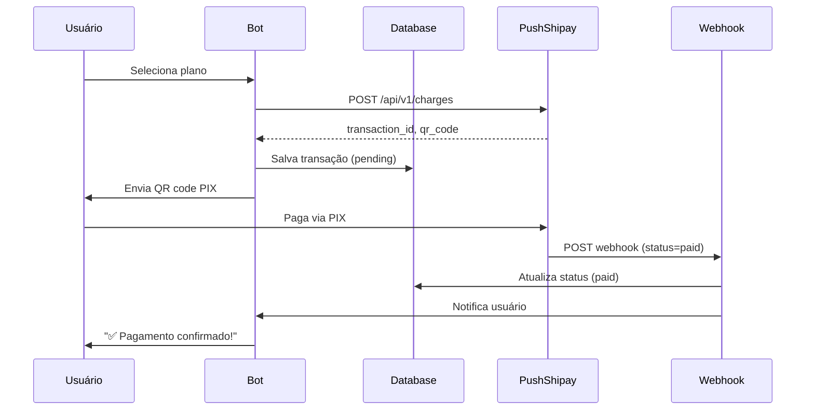

# Bot Telegram de Venda de eSIM

Bot completo para venda de eSIM com pagamento via PIX integrado à PushShipay.

## 🚀 Funcionalidades

### Para Usuários
- ✅ Comprar planos de eSIM
- ✅ Ver perfil e histórico de compras
- ✅ Pagamento via PIX com QR Code e copia-e-cola
- ✅ Confirmação automática de pagamento via webhook
- ✅ Notificação instantânea após pagamento

### Para Administradores
- ✅ Adicionar novos planos
- ✅ Listar todos os planos
- ✅ Editar planos existentes
- ✅ Remover (desativar) planos
- ✅ Adicionar novos administradores

## 📋 Requisitos

- Python 3.10 ou superior
- Conta no Telegram
- Token de bot do Telegram (@BotFather)
- Conta PushShipay com API token
- Servidor com IP público ou túnel (ngrok, localtunnel) para webhook

## 🔧 Instalação

### 1. Clone ou baixe o projeto

```bash
cd telegram-esim-bot
```

### 2. Instale as dependências

```bash
pip install -r requirements.txt
```

### 3. Configure o bot

Edite o arquivo `config.py` ou defina as variáveis de ambiente:

#### Variáveis obrigatórias:

```python
# Token do bot (obtenha com @BotFather no Telegram)
BOT_TOKEN = "1234567890:ABCdefGHIjklMNOpqrsTUVwxyz"

# Token da API PushShipay
PUSHSHIPAY_API_TOKEN = "seu_token_aqui"

# URL base da API PushShipay (padrão: https://api.pushshipay.com)
PUSHSHIPAY_BASE_URL = "https://api.pushshipay.com"

# URL pública do webhook (seu domínio + caminho)
WEBHOOK_PUBLIC_URL = "https://seu-dominio.com/webhook/payment"

# IDs dos administradores (separados por vírgula)
ADMIN_IDS = "123456789,987654321"
```

#### Variáveis opcionais:

```python
# Host e porta do webhook (padrão: 0.0.0.0:8080)
WEBHOOK_HOST = "0.0.0.0"
WEBHOOK_PORT = "8080"

# Caminho do webhook (padrão: /webhook/payment)
WEBHOOK_PATH = "/webhook/payment"

# Secret para validação do webhook (opcional)
PUSHSHIPAY_WEBHOOK_SECRET = ""

# Caminho do banco de dados (padrão: esim_bot.db)
DATABASE_PATH = "esim_bot.db"
```

### 4. Como obter o token do bot

1. Abra o Telegram e procure por `@BotFather`
2. Envie o comando `/newbot`
3. Siga as instruções para criar seu bot
4. Copie o token fornecido

### 5. Configurar webhook público

O bot precisa de uma URL pública para receber confirmações de pagamento.

#### Opção A: Servidor com IP público

Se você tem um servidor com IP público:

```python
WEBHOOK_PUBLIC_URL = "https://seu-servidor.com/webhook/payment"
```

#### Opção B: Túnel local (desenvolvimento)

Para testes locais, use ngrok ou localtunnel:

**Com ngrok:**
```bash
ngrok http 8080
```

Copie a URL HTTPS fornecida:
```python
WEBHOOK_PUBLIC_URL = "https://abc123.ngrok.io/webhook/payment"
```

**Com localtunnel:**
```bash
npm install -g localtunnel
lt --port 8080
```

### 6. Integração com PushShipay

Este bot implementa uma integração genérica com a PushShipay baseada na estrutura comum:

- **Endpoint de criação:** `POST /api/v1/charges`
- **Autenticação:** Bearer token via header `Authorization`
- **Resposta esperada:** JSON com `transaction_id`, `qr_code`, `copy_paste_code`
- **Webhook:** POST com `transaction_id` e `status`

**⚠️ IMPORTANTE:** Ajuste os endpoints e payloads em `payment.py` conforme a documentação oficial da PushShipay que você receber.

## ▶️ Executando o Bot

```bash
python main.py
```

Você verá logs indicando que o bot iniciou com sucesso:

```
2024-01-15 10:30:00 - __main__ - INFO - Configuração validada com sucesso
2024-01-15 10:30:00 - __main__ - INFO - Banco de dados inicializado
2024-01-15 10:30:00 - __main__ - INFO - Handlers registrados
2024-01-15 10:30:00 - __main__ - INFO - Servidor webhook iniciado em 0.0.0.0:8080
2024-01-15 10:30:01 - __main__ - INFO - ✅ Bot rodando! Pressione Ctrl+C para parar.
```

## 📱 Usando o Bot

### Comandos para Usuários

- `/start` - Inicia o bot e mostra menu principal
- Botão "🛒 Comprar eSIM" - Lista planos disponíveis
- Botão "👤 Meu Perfil" - Mostra perfil e histórico

### Comandos para Administradores

#### Adicionar plano
```
/admin_add_plan Europa 10GB | 10 | 59.90
```
Formato: Nome | GB | Preço

#### Listar planos
```
/admin_list_plans
```

#### Editar plano
```
/admin_edit_plan 1 | Europa 15GB | 15 | 79.90 | active
```
Formato: ID | Nome | GB | Preço | Status (active/inactive)

#### Remover plano
```
/admin_remove_plan 3
```
Formato: ID do plano

#### Adicionar administrador
```
/admin_add_admin 123456789
```
Formato: Telegram ID do novo admin

#### Ajuda admin
```
/admin_help
```

### Como descobrir seu Telegram ID

1. Procure por `@userinfobot` no Telegram
2. Envie `/start`
3. O bot retornará seu ID

## 🏗️ Estrutura do Projeto

```
telegram-esim-bot/
├── main.py                 # Entry point principal
├── config.py               # Configurações centralizadas
├── database.py             # Camada de banco de dados SQLite
├── payment.py              # Integração com PushShipay
├── webhook.py              # Servidor webhook aiohttp
├── requirements.txt        # Dependências Python
├── README.md              # Este arquivo
├── esim_bot.db            # Banco de dados (criado automaticamente)
└── handlers/              # Handlers do Telegram
    ├── __init__.py
    ├── start.py           # Menu inicial e /start
    ├── profile.py         # Perfil e histórico
    ├── buy.py             # Compra de eSIM
    └── admin.py           # Comandos administrativos
```

## 🗄️ Banco de Dados

O bot usa SQLite com as seguintes tabelas:

### `users`
- `telegram_id` (PK)
- `username`
- `first_name`
- `created_at`
- `updated_at`

### `plans`
- `id` (PK)
- `name`
- `data_gb`
- `price_brl`
- `is_active`
- `delivery_template` (para entrega futura)
- `created_at`
- `updated_at`

### `transactions`
- `id` (PK)
- `telegram_id` (FK)
- `plan_id` (FK)
- `provider_transaction_id` (único)
- `amount_brl`
- `status` (pending, paid, delivered, failed)
- `qr_code`
- `copy_paste_code`
- `provider_payload` (JSON)
- `delivery_payload` (JSON)
- `created_at`
- `updated_at`
- `paid_at`

### `admins`
- `telegram_id` (PK)
- `created_at`

## 🔄 Fluxo de Pagamento



## 🔌 Ponto de Extensão: Entrega de eSIM

A função `deliver_esim_for_transaction()` em `webhook.py` está preparada para integração futura com fornecedor de eSIM.

### Para integrar entrega automática:

1. Edite `webhook.py`, função `deliver_esim_for_transaction()`
2. Adicione chamada à API do seu fornecedor de eSIM
3. Retorne o payload com dados do eSIM:

```python
async def deliver_esim_for_transaction(transaction: dict, plan: dict, bot) -> dict:
    # Chamar API do fornecedor
    esim_data = await fornecedor_api.create_esim(
        plan_id=plan["id"],
        data_gb=plan["data_gb"]
    )
    
    return {
        "status": "delivered",
        "activation_code": esim_data["code"],
        "qr_code": esim_data["qr"],
        "instructions": esim_data["instructions"]
    }
```

## 🛠️ Ajustes para Produção

### 1. Use variáveis de ambiente

Em vez de editar `config.py`, defina variáveis de ambiente:

```bash
export BOT_TOKEN="seu_token"
export PUSHSHIPAY_API_TOKEN="seu_token_pushshipay"
export WEBHOOK_PUBLIC_URL="https://seu-dominio.com/webhook/payment"
export ADMIN_IDS="123456789,987654321"
```

### 2. Use HTTPS

O webhook deve usar HTTPS em produção. Configure um certificado SSL no seu servidor.

### 3. Configure o webhook secret

Para maior segurança, configure um secret para validar webhooks:

```python
PUSHSHIPAY_WEBHOOK_SECRET = "seu_secret_aqui"
```

### 4. Use um processo manager

Para manter o bot rodando em produção:

**Com systemd:**

Crie `/etc/systemd/system/esim-bot.service`:

```ini
[Unit]
Description=eSIM Telegram Bot
After=network.target

[Service]
Type=simple
User=seu_usuario
WorkingDirectory=/caminho/para/telegram-esim-bot
Environment="BOT_TOKEN=seu_token"
Environment="PUSHSHIPAY_API_TOKEN=seu_token"
ExecStart=/usr/bin/python3 main.py
Restart=always

[Install]
WantedBy=multi-user.target
```

Inicie:
```bash
sudo systemctl enable esim-bot
sudo systemctl start esim-bot
sudo systemctl status esim-bot
```

**Com PM2 (Node.js):**

```bash
npm install -g pm2
pm2 start main.py --interpreter python3 --name esim-bot
pm2 save
pm2 startup
```

### 5. Logs

Configure logs persistentes editando a seção de logging em `main.py`:

```python
logging.basicConfig(
    format='%(asctime)s - %(name)s - %(levelname)s - %(message)s',
    level=logging.INFO,
    handlers=[
        logging.FileHandler("bot.log"),
        logging.StreamHandler()
    ]
)
```

## ⚠️ Troubleshooting

### Bot não inicia

**Erro:** `Configuração incompleta`
- Verifique se todas as variáveis obrigatórias estão configuradas em `config.py`

### Webhook não recebe confirmações

1. Verifique se a URL pública está acessível externamente
2. Teste com curl:
   ```bash
   curl -X POST https://seu-dominio.com/webhook/payment \
     -H "Content-Type: application/json" \
     -d '{"transaction_id":"test","status":"paid"}'
   ```
3. Verifique os logs do bot para erros no webhook

### Erro ao criar cobrança PIX

1. Verifique se o token da PushShipay está correto
2. Confirme a URL base da API
3. Ajuste `payment.py` conforme a documentação oficial da PushShipay

### Comandos admin não funcionam

1. Verifique se seu Telegram ID está em `ADMIN_IDS`
2. Use `/admin_help` para ver a sintaxe correta
3. Certifique-se de usar o separador `|` nos comandos

## 📝 Licença

Este projeto é fornecido como está, sem garantias.

## 🤝 Suporte

Para dúvidas:
1. Verifique este README
2. Confira os logs em tempo real
3. Ajuste `payment.py` conforme a documentação real da PushShipay

## 🎯 Próximos Passos

Após ter o bot funcionando:

1. ✅ Configure seus planos via comandos admin
2. ✅ Teste o fluxo de pagamento completo
3. ✅ Integre a entrega automática de eSIM
4. ✅ Configure monitoramento e alertas
5. ✅ Implante em servidor de produção

---

**Desenvolvido com ❤️ para facilitar vendas de eSIM**
